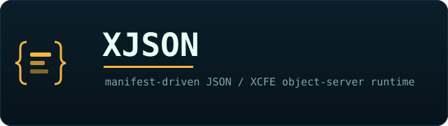

<p align="center"></p>

# XJSON — JSON / XCFE object-server runtime

`json_runtime` (**XJSON**) is a manifest-driven object-server runtime. **JSON
declares; XCFE / K'UHUL executes.** It loads a top-level `manifest.json`, mounts a
registry of `@sidecar` contract manifests (actions, bots, experts, agents, folds,
glyphs, …), and serves them over HTTP alongside an event-sourced object store.

## Build

Visual Studio 2022 (x64). From this directory:

```bat
cmake -B build -G "Visual Studio 17 2022" -A x64
cmake --build build --config Release
```

`lib/` vendors the only two dependencies (cpp-httplib + nlohmann/json). Targets:
`json_runtime` (full server), `sco_runtime`, `scxq2_runtime`, and `sw`
(the sidecar-store CLI). `runtime.bat` is a build/run helper.

```bat
build\Release\json_runtime.exe --manifest manifest.json   # object server on :8787
```

## Sidecar Store

Sidecars are **candidate/compute-only** workers that emit JSON and never collapse,
judge, promote, or mutate the registry. Two kinds, one registry
(`sidecars.manifest.json`):

- **`xcfe_manifest`** — in-process XCFE programs (`@sidecar` + `@ops`), run by `SidecarLoader`.
- **`external_exe`** — compiled worker binaries (e.g. the [Quantum](https://github.com/cannaseedus-bot/Quantum) stack) spawned per call, JSON request on stdin → JSON reply on stdout. Dispatched by `SidecarStore` (`src/sw.cpp`).

Served identically over HTTP:

```text
GET  /api/sidecars                     list (+ store availability)
GET  /api/sidecars/<name>              describe (resolved bin, ops)
POST /api/sidecars/<name>/call/<op>    dispatch
```

CLI + terminal render of the same store:

```bat
sw list        sw frame        sw describe <name>        sw call <name> <op> <json>
pwsh -File Show-Sidecars.ps1 -Refresh 3
```

`sw frame` / `Show-Sidecars.ps1` digitize the store into an AtomicDOM terminal
frame — a read-only presentation of the host-authoritative feed.

## Layout

| Path | What |
|---|---|
| `src/` | C++ runtime (server, XCFE, sidecar loader, `sw` store, ops) |
| `lib/` | vendored headers (cpp-httplib, nlohmann/json) |
| `*.manifest.json` | the XJSON contract manifests (the sidecars) |
| `actions/`, `programs/`, `sco/` | action defs, entry programs, SCO registry |
| `Show-Sidecars.ps1` | terminal render of the sidecar store |

## Related repositories

| Repo | What |
|---|---|
| [NNC-K](https://github.com/cannaseedus-bot/NNC-K) | runtime home — C# runtime, Micronauts, UI, K'UHUL |
| [WebX](https://github.com/cannaseedus-bot/WebX) | K'UHUL Semantic Engine (`kuhul_engine`) |
| [XJSON](https://github.com/cannaseedus-bot/XJSON) | this repo — the JSON object-server runtime |
| [Quantum](https://github.com/cannaseedus-bot/Quantum) | `quantum_trinity` external-exe sidecars |
